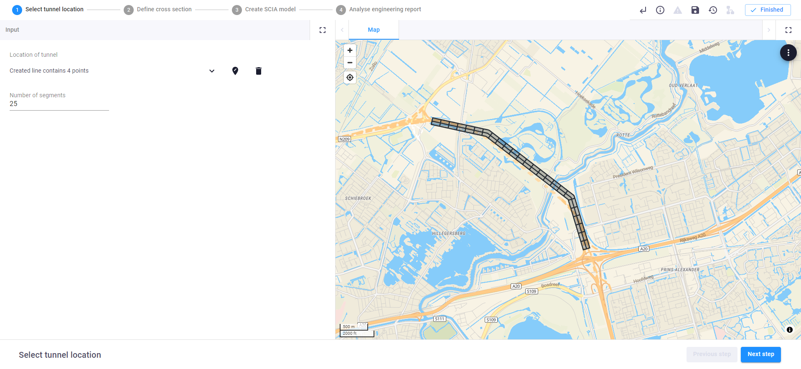
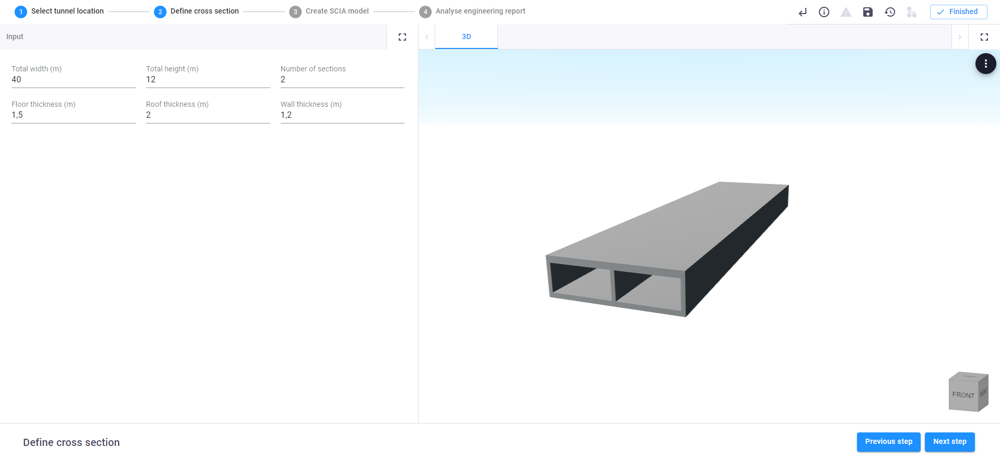
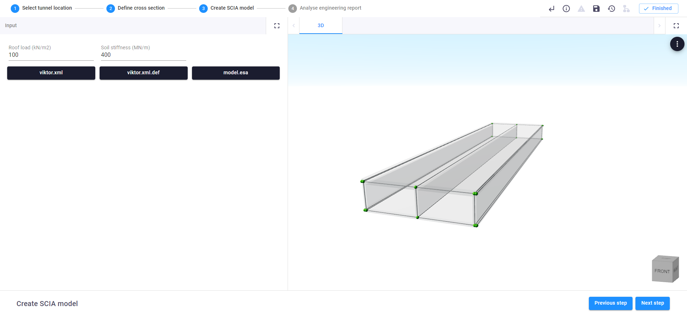

 <Please check version is the same as specified in requirements.txt>

# Tunnel using SCIA
This sample app shows how to create a tunnel model for SCIA

❗ **tip**: Use our [tutorial](https://docs.viktor.ai/docs/guides/tutorials/scia-model) 
to learn how to create SCIA models in Viktor

This app consists of 4 steps:

1. Draw a line on a map and define the number of segments of the tunnel.
2. Fill in the specifications of a segment of the tunnel
3. Define the roof load and the soil stiffness. Then possibly download the files needed to build the tunnel in the SCIA environment
4. generate a pdf showing the internal stress of the tunnel (this can take around 60 seconds)

###Step 1: Select tunnel location

###Step 2: Define cross section

###Step 3: Create SCIA model

###Step 4: Generate engineering report

